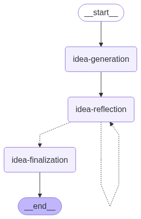

# LangChain / LangGraph version of the AI Scientist v2

## Setup

- Copy the example environment file to `.env`:

```shell
cp .env.example .env
```

- Set the required environment variables in the `.env` file.

```
OPENAI_API_KEY= ...     # If using OpenAI models, set your OpenAI API key here.
LANGSMITH_TRACING= ...  # Optional
LANGSMITH_ENDPOINT= ... # Optional
LANGSMITH_PROJECT= ...  # Optional
LANGSMITH_API_KEY= ...  # Optional
```

## Pipelines

<table>
<thead>
<tr>
<th>Command</th>
<th>Description</th>
</tr>
</thead>
<tbody>
<tr>
<td>

### Research Idea Generation Pipeline

```shell
OPENAI_API_KEY=xxxx uv run ai-scientist-v2 idea-generation \
    --workshop-file test_fixtures/i-cant-believe-its-not-better.md \
    --ideas-file test_fixtures/i-cant-believe-its-not-better.jsonl \
    --idea-generation-model-name "openai:gpt-4o" \
    --idea-reflection-model-name "anthropic:claude-3-5-sonnet-latest" \
    --max-reflection 5
```

</td>
<td>
    
</td>
</tr>
<tr>
<td>

### Paper Generation Experiments Pipeline

```shell
OPENAI_API_KEY=xxxx uv run ai-scientist-v2 paper-generation-experiments \
    ... (WIP)
    
```

</td>
<td>WIP</td>
</tr>
</table>

## Acknowledgements

- SakanaAI/AI-Scientist-v2: The AI Scientist-v2: Workshop-Level Automated Scientific Discovery via Agentic Tree Search https://github.com/SakanaAI/AI-Scientist-v2
